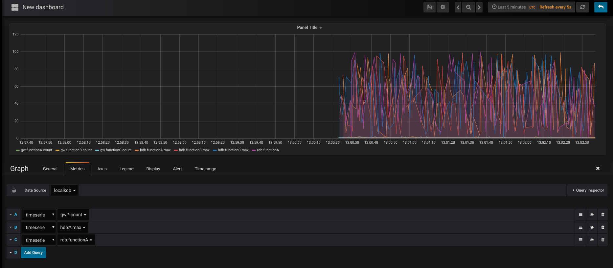

## kdb-grafana
A simple json data source implementation for Grafana in kdb+
  

##### Example Usage
kdb-grafana  
```q grafana.q -p 3001```  
  
client to publish metrics
```
h:hopen `::3001;
metrics:` sv' raze `rdb`hdb`tp`gw,/:\:`functionA`functionB`functionC;
.z.ts:{neg[h](`.gf.upd;first 1?metrics;first 1?100.0)};
\t 100
```

##### Description
Configuration:   

| Variable      | Description       | Default |
| ------------- | ----------------- | ------- |
| `gf.delimiter`| metric delimiter  | `.`     |
| `gf.datadir`  | database directory| `./data`|


Useful variables:

| Variable      | Description                     |
| ------------- | ------------------------------- | 
| `gf.metrics`  | list of metrics recevied        |
| `gf.timeserie`| in-memory mertics records       | 
| `timeserie`   | date-partitioned mertics records|
  
  
##### Features
1. Received metrics will be stored in `gf.timeserie` and will be appended to date-partitioned `timeserie` when `.gf.end[]` is called
2. Support wildcard in grafana metric selection (e.g. `rdb.*`)
3. Support aggregation (e.g. `rdb.*.count`). Supported aggregations can be found in `.gf.agg`

##### Demo

